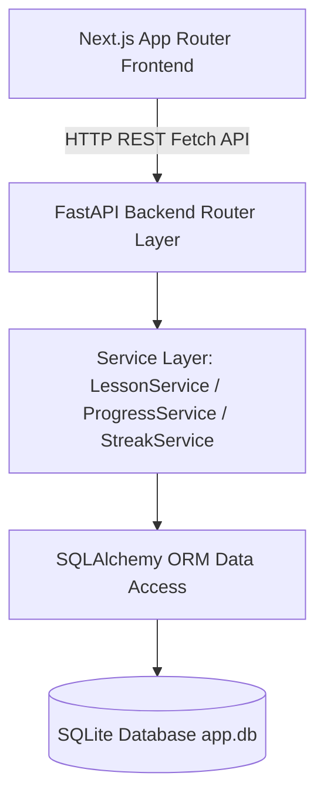
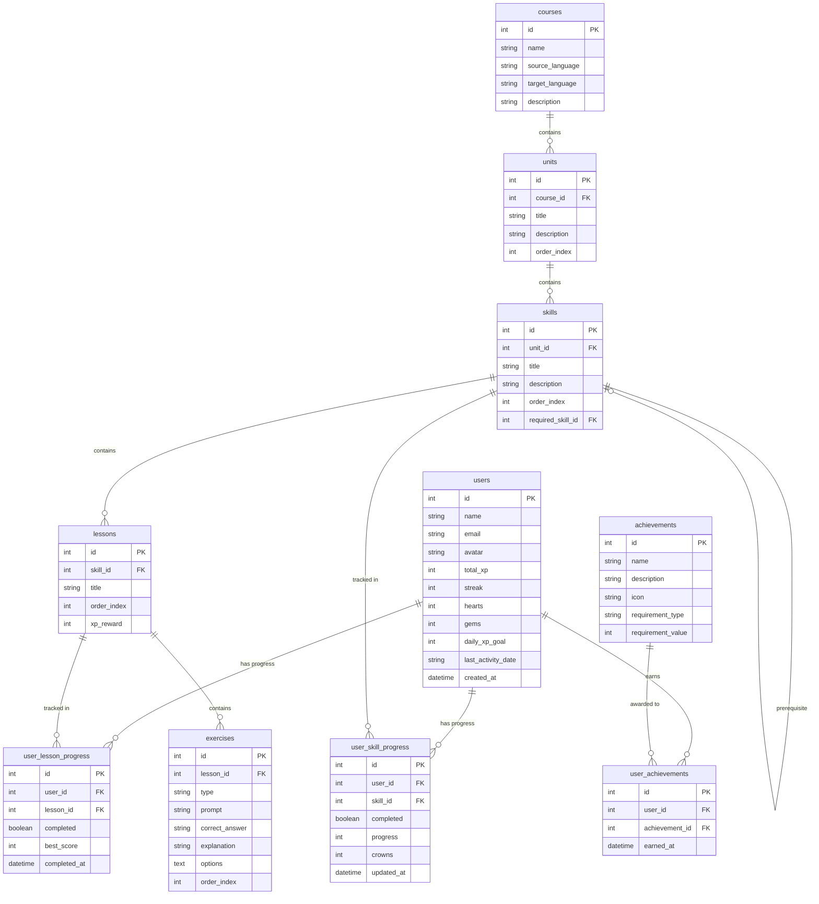

# Duolingo-Style Language Learning Web Application

A full-stack, gamified language-learning application inspired by Duolingo's interaction design and gamification mechanics. Built with a **Next.js (TypeScript, React, Tailwind CSS)** frontend and a **Python FastAPI (SQLAlchemy, SQLite)** backend.

---

## 🚀 Features

- **Interactive Learning Path**: Winding path of units and skill nodes showing `locked`, `available`, `in_progress`, and `completed` states.
- **5 Exercise Types**:
  1. `multiple_choice`: Tap option card.
  2. `translate`: Interactive tap-the-word token sentence builder.
  3. `match_pairs`: Tap-to-match columns exercise.
  4. `fill_blank`: Contextual fill-in-the-blank options.
  5. `type_answer`: Direct text input translation.
- **Immediate Answer Validation**: Real-time feedback drawer displaying success/incorrect banners, correct answers, and explanations.
- **Heart System**: Depletes hearts on wrong answers. Triggers an "Out of Hearts" modal at 0 hearts with free heart refill.
- **Streak & XP Gamification**: Daily streak calculation based on calendar activity dates, XP rewards per exercise and completed lesson, daily XP goals, and celebration confetti.
- **Profile & Achievements**: Learner statistics grid, daily goal progress, and unlocked system achievement badges.
- **Leaderboard**: Real-time ranked global leaderboard highlighting the current learner.

---

## 🛠️ Tech Stack

- **Frontend**: Next.js 15 (App Router), TypeScript, React 19, Tailwind CSS v4, Lucide Icons, Canvas Confetti.
- **Backend**: Python 3.11, FastAPI, Pydantic v2, SQLAlchemy 2.0 ORM, Pytest.
- **Database**: SQLite (`app.db`).

---

## 🏗️ Architecture Overview



---

## 📁 Folder Structure

```text
duolingo-style-app/
├── frontend/
│   ├── app/
│   │   ├── learn/            # Learning path page
│   │   ├── lesson/[lessonId] # Interactive lesson player
│   │   ├── profile/          # User stats & achievements
│   │   ├── leaderboard/      # Ranked user leaderboard
│   │   ├── settings/         # Settings placeholders
│   │   ├── layout.tsx
│   │   └── globals.css       # Design tokens & 3D button styling
│   ├── components/
│   │   ├── layout/           # TopBar, BottomNavigation
│   │   ├── learning/         # LearningPath, UnitCard, SkillNode, ProgressRing
│   │   ├── lesson/           # LessonPlayer, LessonProgress, ExerciseRenderer, FeedbackBar...
│   │   └── profile/          # ProfileStats, AchievementCard
│   ├── lib/
│   │   ├── api.ts            # Strongly-typed API client
│   │   └── types.ts          # TypeScript domain models
│   └── package.json
│
├── backend/
│   ├── app/
│   │   ├── main.py           # FastAPI entrypoint & CORS config
│   │   ├── database.py       # SQLAlchemy engine setup
│   │   ├── models.py         # Database ORM entity models
│   │   ├── schemas.py        # Pydantic request/response schemas
│   │   ├── seed.py           # Database seeder script
│   │   ├── routers/          # learner, course, lessons, leaderboard, profile
│   │   └── services/         # lesson_service, progress_service, streak_service
│   ├── requirements.txt
│   └── app.db
│
├── .env.example
├── .gitignore
├── INTERVIEW_NOTES.md
└── README.md
```

---

## 📊 Database Schema



---

## 🔌 Key API Endpoints

| Method | Endpoint | Description |
| :--- | :--- | :--- |
| `GET` | `/api/learner` | Fetch current learner details, hearts, streak, and daily XP |
| `POST` | `/api/learner/refill-hearts` | Reset learner hearts back to 5 |
| `GET` | `/api/course` | Fetch full learning path with skill unlock and progress states |
| `GET` | `/api/lessons/{id}` | Fetch lesson exercises and meta info |
| `POST` | `/api/lessons/{id}/answer` | Validate exercise answer, reduce hearts if wrong, award exercise XP |
| `POST` | `/api/lessons/{id}/complete` | Mark lesson complete, award lesson XP, update streak & unlock skills |
| `GET` | `/api/leaderboard` | Fetch global leaderboard ranked by XP |
| `GET` | `/api/profile` | Fetch learner stats, completed counts, and achievements |

---

## ⚡ Quick Setup & Running Locally

### Prerequisites
- Node.js v18+ and npm
- Python 3.10+

### 1. Backend Setup

```bash
cd backend
py -3 -m venv venv

# Windows PowerShell:
.\venv\Scripts\activate

# Install dependencies
pip install -r requirements.txt

# Seed the SQLite database
python -m app.seed

# Launch FastAPI development server
uvicorn app.main:app --reload
```

Backend server runs at: `http://localhost:8000`  
Swagger API Docs available at: `http://localhost:8000/docs`

### 2. Frontend Setup

In a separate terminal:

```bash
cd frontend
npm install
npm run dev
```

Frontend application runs at: `http://localhost:3000`

---

## 📝 Assumptions

1. **Authentication**: Simplified default user (`User ID = 1`) without complex login tokens.
2. **Database**: SQLite DB (`app.db`) used per assignment specification.
3. **Heart Refill**: Mocked free instant refill option when hearts reach zero.
